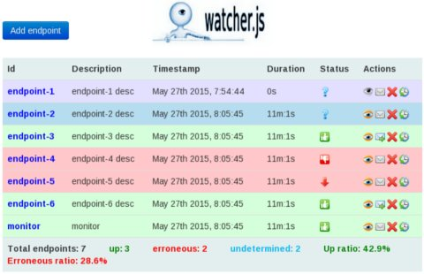
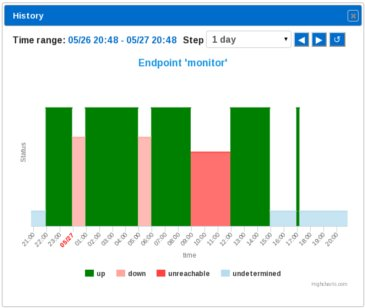

__watcher.js__ is a node.js based application that can be used to monitor service status. It is not a competitor
of [nagios](http://www.nagios.org/) or [zabbix](http://www.zabbix.com/) or any other advanced monitoring tool.
Although, it can be a solution for simple cases.
The application architecture is simple. At regular intervals service specific defined messages,
either as http requests or as raw data to sockets, are send to the service endpoints to find out their status.
On the service status resolution, the status is stored internally and is made available either programmatically or
via REST requests. The application, at design level, is extensible since custom defined behaviors can be easily
applied.

----

## Technical overview

The main application components follows:

### _[Resolution strategies and status resolver](http://htmlpreview.github.io/?https://github.com/jpsoroulas/watcherjs/blob/master/doc/api/modules/resolvers.html)_
The _status resolver_ implements the context for applying the strategy for service status resolution, whereas the
_resolution strategy_ the strategy itself. The strategy is described by a set of methods. Each method is called at a
specific stage during the conversation with the endpoint and returns the outcome of the service status.
The __resolution strategy__ is application's __extension point__ since custom defined strategies could be applied.
Note that the user can independently register any number of resolution strategies and refer to them by their ids.
A service could be marked as:

 * _up_, when the service is up and running.
 * _down_, when the service is down.
 * _undetermined_, when no decision can be made.
 * _unreachable_, status that is used by the connector when no connection with the endpoint can be made.

Detailed documentation and examples can be found at:
[resolvers](http://htmlpreview.github.io/?https://github.com/jpsoroulas/watcherjs/blob/master/doc/api/modules/resolvers.html) and
[socket-connector.js](examples/socket-connector.js)

### _[Connectors](http://htmlpreview.github.io/?https://github.com/jpsoroulas/watcherjs/blob/master/doc/api/modules/connectors.html)_
A connector is responsible for connecting, communicating and determining the service status using the _status resolver_
along with the appropriate _resolution strategy_. Each connector handles a specific type of communication with an _endpoint_.
Currently there are two types of connectors, the _socket connector_ that enables the communication via raw socket
(the data is transmitted as utf-8 encoded string) and the _http connector_ that makes possible the communication via
http(s) protocol.

Detailed documentation and examples can be found at:
[connectors](http://htmlpreview.github.io/?https://github.com/jpsoroulas/watcherjs/blob/master/doc/api/modules/connectors.html),
[socket-connector.js](examples/socket-connector.js) and [socket-connector.js](examples/http-connector.js)

### _[Watcher](http://htmlpreview.github.io/?https://github.com/jpsoroulas/watcherjs/blob/master/doc/api/modules/watcher.html)_
This is the main application component. It provides the factory method for creating an application instance.
The application configuration consists of two parts; the one that refers to the express framework that implements
application's http interface, and the other that refers to the service endpoints.

Detailed documentation and examples can be found at:
[watcher](http://htmlpreview.github.io/?https://github.com/jpsoroulas/watcherjs/blob/master/doc/api/modules/watcher.html),
[watcher-extended.js](examples/watcher-extended.js) and [watcher-minimal.js](examples/watcher-minimal.js)

### _[REST API](http://htmlpreview.github.io/?https://github.com/jpsoroulas/watcherjs/blob/master/doc/api/modules/watcher-http.html)_
The entire application API is exposed as REST services. For the REST API implementation
the [express](http://expressjs.com) web framework is used. It is worth mentioning that the user can define
__route extension points__ in order to build custom responses for the status requests.

Detailed information about the REST interface and examples can be found at:
[watcher-http](http://htmlpreview.github.io/?https://github.com/jpsoroulas/watcherjs/blob/master/doc/api/modules/watcher-http.html) and
[watcher](http://htmlpreview.github.io/?https://github.com/jpsoroulas/watcherjs/blob/master/doc/api/modules/watcher.html) and
[watcher-extended.js](examples/watcher-extended.js)

### Real time event notification
A [socket.io](http://socket.io/) client can be used for real time event notification from the system. At the moment
a client could be notified when the endpoints status has been updated (this feature is used by the web console
to update the display of the monitored endpoints).
See at [watcher events](http://htmlpreview.github.io/?https://github.com/jpsoroulas/watcherjs/blob/master/doc/api/classes/WatcherEvents.html).

----

## Watcher web console
On top of the application's REST services, a simple but handy web GUI is implemented, the _watcher web console_.
The console enables the user to dynamically add/remove/modify and monitor endpoints visually.
It can be accessed at http://localhost:`<port>`/console, where `<port>` the http-server port defined at
application startup (7777, if default configuration is used).
Screenshots from the console follow below.

The console illustrates the list of the monitored endpoints along with their related information.
More specifically, the endpoint id (Id), the endpoint description (Description), the endpoint status (Status),
the timestamp of the current status (Timestamp) and the period where the current status has lasted (Duration).
At the column 'Actions' the user can activate/deactivate the endpoint (eye icon),
enable/disable notification (mail icon), delete the endpoint (cross icon) and show the endpoint status history chart
(the last icon). Note that the deletion causes the permanent endpoint information removal from the storage
(the dynamically added endpoints from the console are stored at the filesystem under the directory _storage_, see at
[watcher](http://htmlpreview.github.io/?https://github.com/jpsoroulas/watcherjs/blob/master/doc/api/modules/watcher.html))
At the bottom of the page some statistical is presented.

When the button 'Add endpoint' is pressed, the form of adding a new endpoint is appeared. The parameters that the user
should set depends on the connector type ('socket' or 'http(s)'). Note the 'Resolution strategy' drop-down list where
a unbound resolution strategy (if any) could be selected.






----

## API summary
The application features can be summarized as follows:

  * add/remove endpoint
  * activate/deactivate endpoint
  * enable/disable email notification on erroneous service status
  * store endpoint configuration (at the file system for easy modification)
  * Query endpoint(s) status history
  * define custom _status resolution strategy_ for specific endpoint
  * define pool of custom _unbound status resolution strategies_
  * define route extensions for building custom responses for the _status requests_

----

## Release Notes

Changelog: For changelogs and release notes,
see the [changelog](https://github.com/jpsoroulas/watcherjs/blob/master/changelog.md) file.

## Installation

* Install [nodejs](https://nodejs.org/)
* Install or configure an existing installation of [mongoDB](http://www.mongodb.org/)
(for configuration see at API documentation)
* Download project and extract it at a desire location
* Under the project root directory execute
```
$ npm install
```
to download and install project dependencies

## Docs/Examples
* [API documentation](https://github.com/jpsoroulas/watcherjs/blob/master/doc/api)
* [Examples](examples/)

## Quick Start
Start the watcher.js with default configuration as show at the example
[watcher-minimal.js](examples/watcher-minimal.js) and access the web console console at
```
http://localhost:7777/console
```

----

## License
Distributed under the terms of [the MIT license](LICENSE-MIT).

----

Copyright &copy; 2015 John Psoroulas


